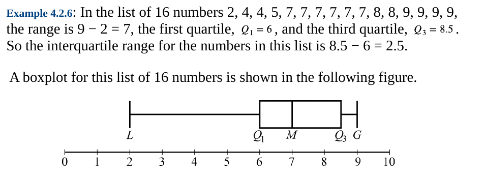

# Strats
### B-D method
if the answers are in the increasing order, you firstly check __B__ then __D__
- A
- __B__
- C
- __D__
- E

#### general guidelines
- __Be aware of limits and borders__
- __use algebraic repesentation__ guessing is not a winnig strategy
<!-- - __Combinations formula__ -->

- if you have only centers of the data (mean and median), you can construct vaious ranges to suffice given conditions

- Write down all the simple calculations
- in common deminator problems represent answer using powers
- где-то достатоно оценить порядок
- скипать хуйню это нормально
&nbsp;
- Может быть ебливая просьба округлить очевидный ответ: _Give your answer to the nearest 0.05_
&nbsp;

#### angle of n-angler
$$
a_n = \frac{(n-2) \cdot 180}{n}
$$

#### arithemtic progression sum
$$
\begin{gathered}
S_n = \frac{(a_1+a_n)}{2} n \\
a_n = a_1 + (n-1)d \\
S_n = \frac{2a_1+(n-1)d}{2} n \\
\end{gathered}
$$

#### geometric progression sum
$$
\begin{gathered}
S_n=\frac{b_n q-b_1}{q-1}\\
b_n=b_1 q^{n-1} \\
S_n=\frac{b_1\left(q^n-1\right)}{q-1} \\
\end{gathered}
$$

#### mixture =\\= solution
$$ \frac{m_a}{m_{total}} = fraction $$

#### compond interest several times per year
$$ Inv  = Base\cdot \left(1+ \frac{\%}{100  n} \right)^{n\cdot t_{years}}$$

## Statistics
#### Median
 If n is __odd__, then the median is the middle number in the ordered list ofnumbers.
 If n is __even__, then there are two middle numbers, and the median is the __average of these two numbers__.

#### The range
of the numbers  is the difference between the greatest number G in the data and the least number L.

#### Standard diviation ($\sigma$)
$$
2,4,4,4,5,5,7,9 .
$$
These eight data points have the mean (average) of 5 :
$$
\mu=\frac{2+4+4+4+5+5+7+9}{8}=\frac{40}{8}=5 .
$$
First, calculate the __deviations__ of each data point from the mean, and square the result of each:
$$
\begin{array}{ll}
(2-5)^2=(-3)^2=9 & (5-5)^2=0^2=0 \\
(4-5)^2=(-1)^2=1 & (5-5)^2=0^2=0 \\
(4-5)^2=(-1)^2=1 & (7-5)^2=2^2=4 \\
(4-5)^2=(-1)^2=1 & (9-5)^2=4^2=16
\end{array}
$$
The __variance__ is the mean of these values:
$$
\sigma^2=\frac{9+1+1+1+0+0+4+16}{8}=\frac{32}{8}=4
$$
and the population standard deviation is equal to the square root of the variance:
$$
\sigma=\sqrt{4}=2
$$

- s __How many standard diviations above the mean?__
    $$ \text{ntimes} = \frac{s-\mu}{\sigma}  $$

The __mode__ of a list of numbers is the number that occursmost frequently in the list.

__Interquartile range__ is defined as the difference between the third quartile and the first quartile; that is, $Q_3-Q_1 $. Thus, the interquartile range measures the spread of the middle half of the data.

__Qaurtiles__ divide the data into roughly equal groups after the data have been ordered from the least value $L$ to the greatest value $G$
#### Boxplot

### Probability
#### Permutation

n-factorial!

permutations of n objects taken __k at a time__:
$$ \frac{n!}{(n-k)} $$
#### Combinations
порядок неебт
$$ \frac{n!}{k!(n-k!)} $$

#### Normal distribution
- Property 1: The mean, median, and mode are all nearly equal.
- Property 2: The data are grouped fairly symmetrically about the mean.
- Property 3: About two-thirds of the data are within 1 standard deviation of the mean.
- Property 4: Almost all of the data are within 2 standard deviations of the mean.

#### Tips
- When there is average manipulation it is prudent to think about the sum:
    52 average of 10 &emsp;   sum = 520
    53 average of 9  &emsp;   sum = 477
    thrown away 520 - 477 = 43

- Impossible number means pattern:
    10^32 + 2   ->      10002 1002 102
